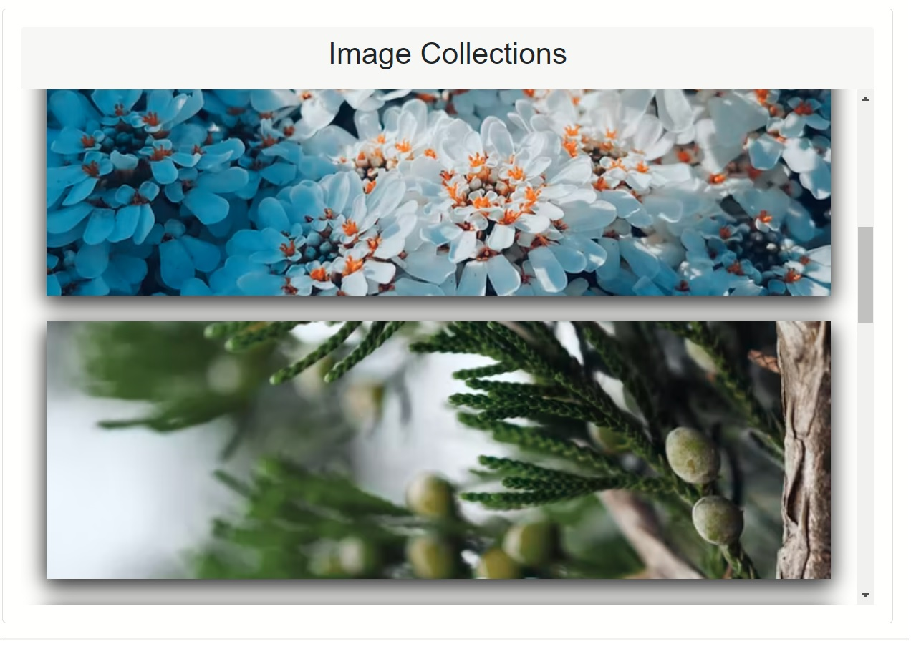
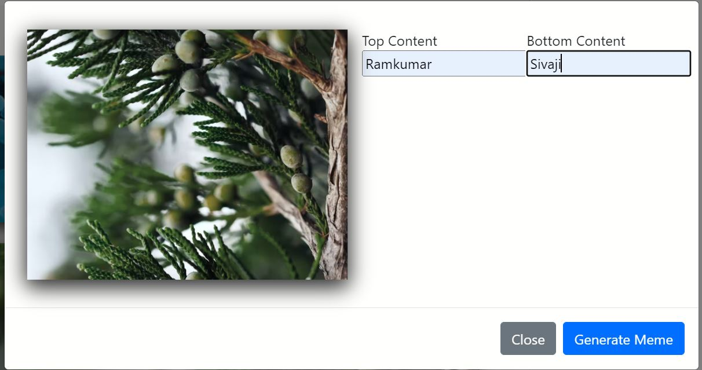
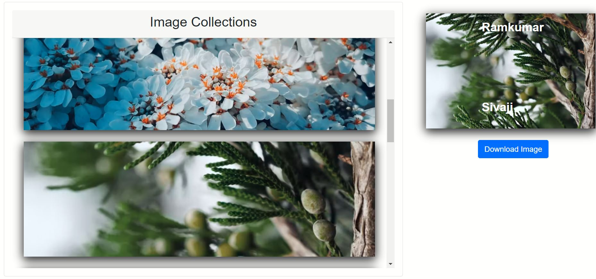
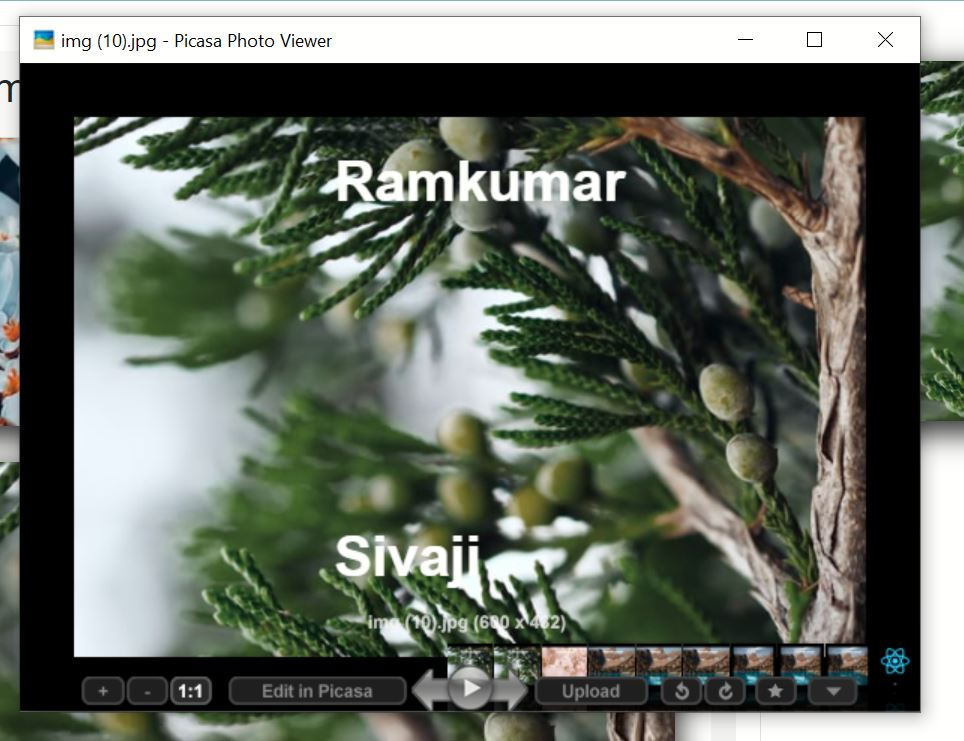

# react-meme-creator
 
Task:

Build a meme generator which allows users to customize it and place their own text on meme images fetched. The text can be inserted at the top or bottom of the image. The solution should provide the input fields for both and ask users their choice of placement. The images can be fetched automatically and having a database for them is advised.

## Resources

Images Collected from the [unsplash](https://images.unsplash.com). 

This project was bootstrapped with [Create React App](https://github.com/facebook/create-react-app).

## Sample Images

## Usage

With `yarn start or npm start` you can start the development server and look at the app at http://localhost:3000.

Load images from api
Click on the image and open modal box
Input your top and bottom text, choose the Meme you would like to have and then click on "Generate Meme"
your Meme. If you like it, then you can click on "Download".
